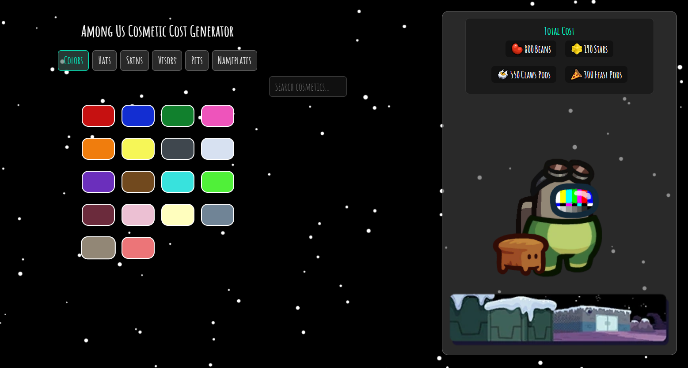

# Among Us Cosmetic Cost Calculator

A **fan-made web app** that lets you build your **Among Us** character and calculates the total in-game cost of your selected cosmetics.

---

## Features
- 🧢 Choose from all Among Us hats, skins, visors, pets, and nameplates  
- 🫘 Automatically calculates costs in **Beans**, **Stars**, and **Pods**  
- ⚠️ Supports unobtainable cosmetics (marked in orange)  
- 🖼️ Visual preview of your character and total cost  
- 🛜 Works entirely offline after setup  

---

## How It Works
This project includes metadata and image assets for most cosmetics available in **Among Us**.  
The calculator adds up their in-game cost across different currencies — Beans, Stars, and Pods (grouped by Cosmicube type).

Each cosmetic’s cost, availability, and unlock requirements are based on data from **Innersloth’s game content** and publicly available information on the [Among Us Wiki](https://among-us.fandom.com/wiki/Among_Us_Wiki).

---

## Disclaimer

This project is a **non-commercial fan creation** and is **not affiliated with, endorsed by, or sponsored by Innersloth LLC** in any way.  

> “Among Us,” its characters, assets, and all related materials are the intellectual property of **Innersloth LLC**.  
> All in-game visuals used in this project remain © Innersloth LLC.  

This calculator is provided for **educational and entertainment purposes only**, in accordance with Innersloth’s official [Fan Creation Policy](https://www.innersloth.com/fan-creation-policy/).

---

## Licensing

- **Code:** Licensed under the [MIT License](LICENSE)  
- **Assets:** Game-related images and data are © Innersloth LLC and are used here under fair use for non-commercial fan content.  
  You may not reuse these images or redistribute them for commercial purposes.

---

## Credits
- **Game Developer:** [Innersloth LLC](https://www.innersloth.com/)  
- **Game Wiki Reference:** [Among Us Wiki](https://among-us.fandom.com/wiki/Among_Us_Wiki)  
- **Tool Creator:** [Byt37](https://github.com/byt37)
